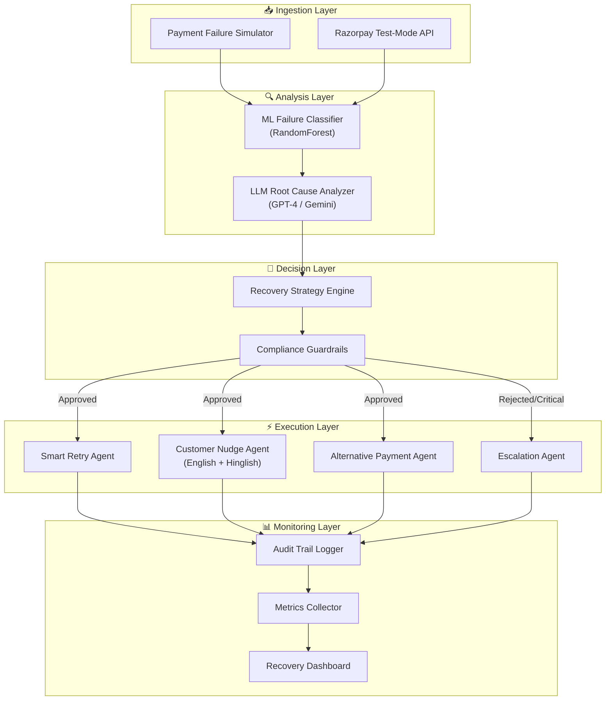
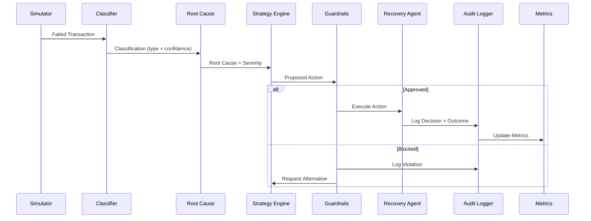

# RecoverAI — System Architecture

## Overview

RecoverAI is a multi-agent AI system designed to detect, diagnose, and recover failed payments. It combines traditional ML (for classification), LLM reasoning (for root cause analysis and decision-making), and rule-based compliance (for safety guardrails).

## Design Principles

1. **Measured, not magic** — Every action produces measurable outcomes with honest metrics
2. **Bounded autonomy** — AI agents operate within strict compliance guardrails
3. **Audit everything** — Every decision is logged with reasoning for explainability
4. **Graceful degradation** — If LLM fails, fall back to rule-based; if all else fails, escalate to human
5. **Defense-only** — System recovers revenue; it never processes unauthorized transactions

## System Architecture



## Component Details

### 1. Ingestion Layer

**Payment Failure Simulator** (`simulator/failure_generator.py`)
- Generates 100+ realistic failed payment transactions
- Covers 10+ failure types across card, UPI, netbanking, and wallet methods
- Realistic distributions: amounts (₹100-₹50,000), timestamps (7-day window), metadata
- Configurable recoverable ratio (default 65%)

**Razorpay API Client** (`razorpay/client.py`)
- Wraps Razorpay Python SDK for test-mode operations
- Handles: payment creation, fetching, refunds, subscriptions
- Built-in retry logic and error handling

### 2. Analysis Layer

**ML Failure Classifier** (`agents/classifier.py`)
- **Algorithm**: RandomForest / GradientBoosting ensemble
- **Features**: amount_bucket, payment_method, time_of_day, day_of_week, attempt_count, device_type
- **Classes**: 10 failure types (INSUFFICIENT_FUNDS, BANK_TIMEOUT, INVALID_CARD, etc.)
- **Output**: FailureClassification with type + confidence score
- **Metrics**: Per-class precision, recall, F1 (reported honestly)

**LLM Root Cause Analyzer** (`agents/root_cause.py`)
- **Primary**: OpenAI GPT-4 for structured root cause analysis
- **Fallback**: Google Gemini API, then rule-based heuristics
- **Input**: PaymentTransaction + FailureClassification
- **Output**: RootCauseAnalysis with explanation, severity, and recommended actions
- **Safety**: Structured output parsing, no hallucination tolerance on financial data

### 3. Decision Layer

**Recovery Strategy Engine** (`agents/strategy_engine.py`)

Decision matrix:

| Condition | Action |
|---|---|
| Retriable failure + low attempt count | Smart Retry |
| Customer-fixable (expired card, wrong PIN) | Customer Nudge |
| Method-specific failure | Alternative Payment |
| High value OR critical severity OR max retries exceeded | Escalation |
| Compliance violation detected | Block + Log |

**Compliance Guardrails** (`compliance/guardrails.py`)

| Rule | Threshold | Rationale |
|---|---|---|
| Max retries | 3 per transaction | Prevent harassment |
| Cooldown between retries | 2 hours | RBI mandate spacing |
| Quiet hours | 9PM - 8AM | No customer contact |
| Max nudges per day | 2 per customer | Anti-spam |
| Escalation threshold | ₹10,000+ | High-value oversight |
| Risk-blocked | No retry ever | RBI compliance |
| Opt-out | Immediate stop | Customer rights |

### 4. Execution Layer

**Smart Retry Agent** (`agents/retry_agent.py`)
- Optimal timing: salary days (1st, 15th), weekday mornings, low-traffic windows
- Method selection: if card failed, try with same card at better time; if repeated, suggest UPI
- Bounded: max 3 retries with 2-hour cooldown

**Customer Nudge Agent** (`agents/nudge_agent.py`)
- **Hinglish support**: "Aapka ₹2,500 ka payment fail ho gaya. UPI se try karein?"
- Channel selection: SMS for urgent, email for detailed, WhatsApp for engagement
- Personalized based on failure context and customer history
- Respects quiet hours and daily limits

**Alternative Payment Agent** (`agents/alternative_agent.py`)
- Fallback logic: Card → UPI → Netbanking → Wallet
- Success probability estimation per alternative method
- Customer-friendly explanation of why alternative is suggested

**Escalation Agent** (`agents/escalation_agent.py`)
- Triggers on: high value, repeated failures, risk blocks, critical severity
- Generates comprehensive escalation report with full context
- Preserves all diagnostic data for human reviewer

### 5. Monitoring Layer

**Audit Trail Logger** (`compliance/audit.py`)
- Every agent action logged: who, what, why, when, outcome
- Compliance check result attached to each entry
- Exportable as JSON for regulatory review
- Queryable by transaction_id

**Metrics Collector** (`pipeline/metrics.py`)
- Real-time aggregation: recovery rate, amount recovered, throughput
- Breakdown by: failure type, recovery action, time period
- Before/after comparison (AI vs 15% baseline recovery rate)
- Markdown report generation for documentation

**Recovery Dashboard** (React frontend)
- Live metrics overview with charts
- Transaction-level drill-down
- Audit trail viewer
- Before/after comparison visualization

## Data Flow



## Error Handling Strategy

```
Level 1: LLM API available     → Full AI analysis + recovery
Level 2: LLM API unavailable   → Rule-based analysis + recovery
Level 3: Classification fails  → Default to most common failure type + escalate
Level 4: All recovery fails    → Escalate to human with full diagnostic data
Level 5: System error          → Log error, skip transaction, continue batch
```

No single transaction failure stops the pipeline. Every error is logged and counted in metrics.

## Security & Privacy

- All transactions are synthetic or test-mode — no real customer data
- API keys stored in .env (gitignored), never committed
- No PII in logs — customer_id is anonymized
- All communications (nudges) are simulated, not actually sent
- Defense-only system design — cannot process unauthorized payments
